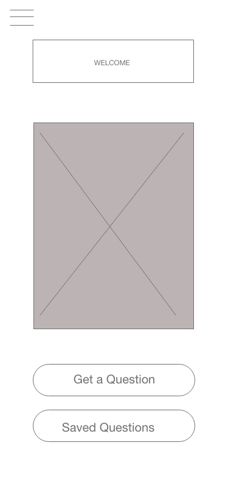
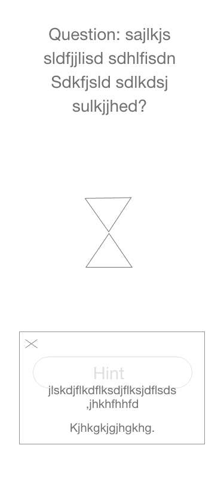
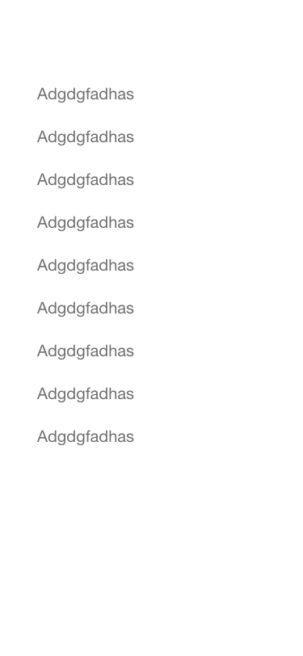

# SqueakBotMobile

## Authors' Names:

- Alistair Blake 
- Julie Erlemeier
- Adrian Huebner
- David Zheng 

## User Stories:
1.	As a developer of this app, I want to create a mobile version of it, so that the users can practice code challenges in different locations.
2.	As a developer of this app, I want to incorporate authentication into this app, so the user has a safe path to access the content.
3.	As a user of this app, I want to have a timer option, so I know how much time I have left to complete the challenge.
4.	As a user of this app, I want to have a hint option, so I can get some assist in solving the question.
5.	As a user of this app, I want to be able to leave comments/see comments, so I can see how other people have solved the problem. 

## About SqueakBotMobile:
This is a mobile app using React Native that helps the user practice white boarding questions. 
SqueakBotMobile is a helpful mock interviewer for a software developer to practice common whiteboard questions in 
preparation for job interviews in the tech industry. It uses AI technology to listen to a users request and outputs a 
question. When a user asks, "Give me a challenge", the google API will receive your request through the microphone on a 
mobile device. Using a Node Server, it pulls a random question from a SQL database and reads it out loud.

## Domain Model:

## Database Entity-Relationship-Diagram

## WireFrame

### Home Page

### Nav

### Get a Question

### Hint

### Saved Questions

## Additional Source
- Our stopwatch on Question Page (https://reactnativecode.com/create-stopwatch-timer/)

