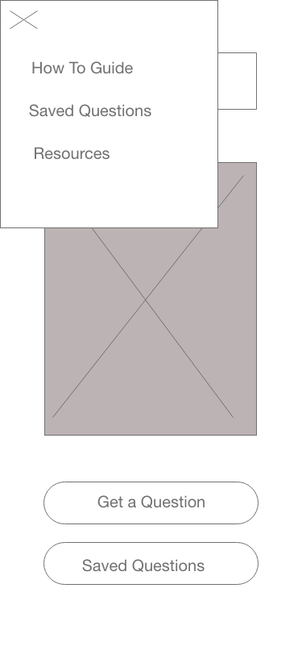
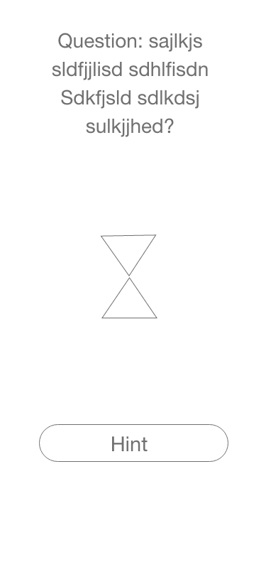

# SqueakBotMobile

## Authors' Names:

- Alistair Blake 
- Julie Erlemeier
- Adrian Huebner
- David Zheng 

## User Stories (link):
https://docs.google.com/document/d/1V3vHAAr9Et7yx5gxecP3NDVkbyr2nbVjuzlS6bW9Q0Y/edit?usp=sharing

## About SqueakBotMobile:
This is a mobile app using React Native that helps the user practice white boarding questions. 
SqueakBotMobile is a helpful mock interviewer for a software developer to practice common whiteboard questions in 
preparation for job interviews in the tech industry. It uses AI technology to listen to a users request and outputs a 
question. When a user asks, "Give me a challenge", the google API will receive your request through the microphone on a 
mobile device. Using a Node Server, it pulls a random question from a SQL database and reads it out loud.

## Domain Model:

## Database Entity-Relationship-Diagram

## WireFrame

### Home Page

### Nav

### Get a Question

### Hint

### Saved Questions

